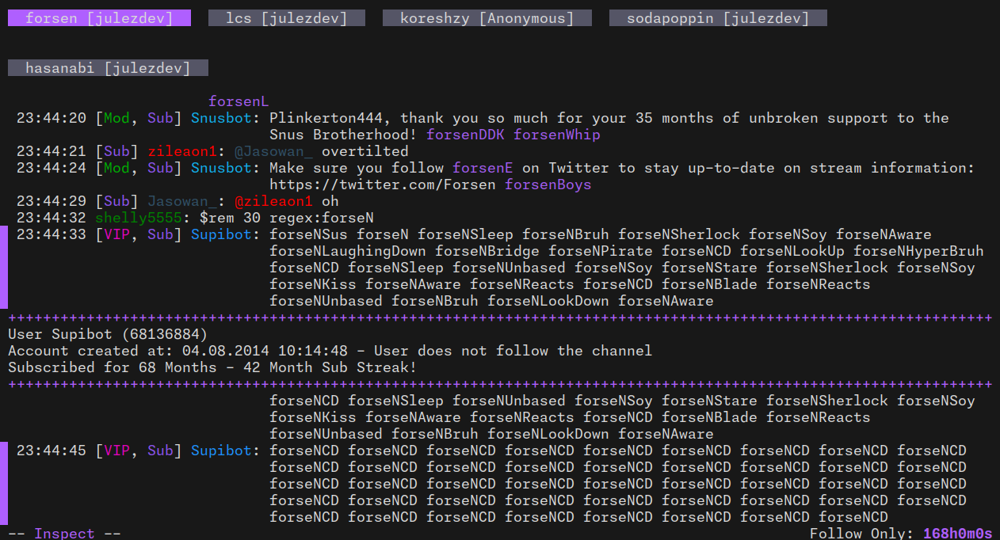

# Chatuino

Cha*tui*no is a TUI utilizing bubbletea to bring a feature rich Twitch Chat Client to your terminal.

> **Note**: This project is still in early development

## Table of Contents

- [Introduction](#introduction)
- [Features](#features)
- [Installation](#installation)
- [Usage](#usage)
- [License](#license)

## Introduction

Chatuino aims to be a feature rich and portable Twitch Chat Client for your terminal.

The name and idea to create a Twitch Chat Client is inspired by [Chatterino](https://github.com/Chatterino/chatterino2).

## Features

- Multi Account support
- Multi Tab support/Can join multiple channels and switch between them
- Join Chat as anonymous User
- Auto resize when window size changes
- You can host the server component for authentication/anonymous usage yourself
- Emote Suggestions
- Local save state to persist sessions
- Simple emote support for Twitch(purple) and SevenTV(blue) emotes (Emotes are colored), graphic display planned
- Advanced moderation tools planned
- More twitch integration planned (Announcements etc.)

## Installation

You can use go install to install the program (`go install github.com/julez-dev/chatuino`)

## Usage

The binary comes with the account management, the TUI itself and the server component if you want to self host the server.

You can use the --help flag to get help.

### account sub-command

You can use the account sub-command to link your twitch account to Chatuino. The command will launch a TUI to help you manage your accounts.

If want to link a new account you need to provide a user token to Chatuino which you can generate with the server component. You can start the auth flow here: `https://chatuino-server.onrender.com/auth/start` or your own server if you want to.

### key-binds

Currently key-binds are hard coded and can not be changed.

Here is an short overview

| key-bind | where | description |
| -------- | ----- | ----------- |
| F1       | Home/In channel | Join a new channel |
| Tab | Join channel prompt | Switch between input fields |
| Enter | Inputs | Confirm |
| j | In lists/Chat window | Down |
| k | In lists/Chat window | Up |
| q | In window(tab) | Quit channel |
| i | In window(tab) | Insert mode for writing/sending chat message |
| down arrow | Insert mode | Next suggestion |
| down arrow | Insert mode | Previous suggestion |
| tab | Insert mode | Accept suggestion |
| esc | Insert mode | Quit Insert mode |
| u | Chat window message | Open user inspect window
| esc | User inspect window | Quit user inspect window |
| ctrl+c | Everywhere | Quit |

### server sub-command and hosting you own server

The server is responsible for dealing with authentication flows and proxying requests to the Twitch API that require an App Access Token when using an anonymous User. My hosted version is available under `https://chatuino-server.onrender.com` but you can just run your own version as well.

For this you need to register a new application in the [twitch dev console](https://dev.twitch.tv/console) which will give you an Client ID and Client Secret. The server command requires both as environment variables (Launch `chatuino server help` for more information).

Then you need to configure Chatuino to use your Client ID and API Host (Can be localhost too!)

## License

This project is licensed under the MIT license. See the [LICENSE](LICENSE) file for details.
