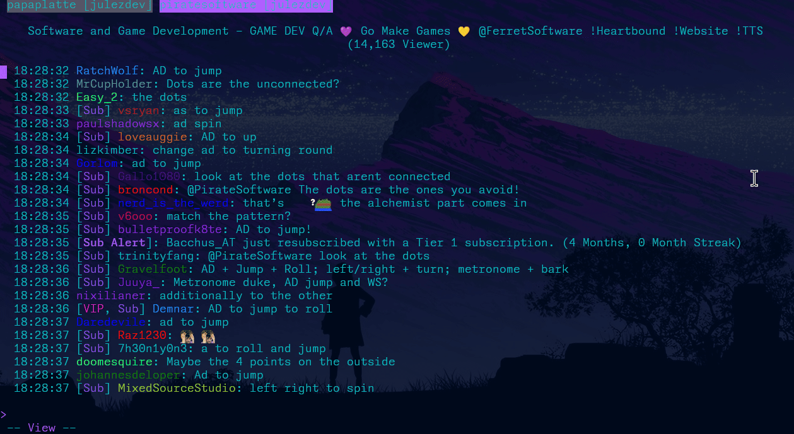

# Chatuino

Cha*tui*no is a cross-platform TUI utilizing bubbletea to bring a feature rich Twitch Chat Client to your terminal.

> **Note**: This project is still in early development (colors may be weird, terminals may not work, panics may happen and resizing may cause issues/become glitchy etc.)

## Table of Contents

- [Introduction](#introduction)
- [Features](#features)
- [Installation](#installation)
- [Usage](#usage)
- [License](#license)

## Introduction

Chatuino aims to be a feature rich and portable Twitch Chat Client for your terminal.

The name and idea to create a Twitch Chat Client and many features are inspired by [Chatterino](https://github.com/Chatterino/chatterino2) and [twitch-tui](https://github.com/Xithrius/twitch-tui).

## Features

- Multi Account support
- Join as many Chats as you want
- Join Chats as Anonymous User
- [Custom Themes](/doc/THEME.md)
- You can host the server component for authentication/anonymous usage yourself
- Graphical display of emotes (kitty terminal only; ghostty only non-animated emotes)
- Emote and User Suggestions/Autocompletion
- Local save state to persist sessions
- Manage ban requests
- View detailed user data with user inspect mode
- Quick ban users with ctrl+shift+t
- Copy and Paste messages with alt+c
- Simple Twitch duplicate message bypass
- Support for viewing twitch polls in your own channel
- Custom chat commands for fast copy pasta spamming
- Use feature rich templating for custom commands and message inputs
- Special tabs like mentions and live notifications
- Chat is moving too fast? Try the /localsubscribers and /uniqueonly chat modes

Read more about Chatuinos features [here](doc/FEATURES.md)

## Installation

You can use go install to install the program (`go install github.com/julez-dev/chatuino@latest`) or grab a binary from the [releases](https://github.com/julez-dev/chatuino/releases) page.

## Usage

The binary comes with the account management, the TUI itself and the server component if you want to self host the server.

You can use the --help flag to get help.

### Account sub-command

You can use the account sub-command to link your twitch account to Chatuino. The command will launch a TUI to help you manage your accounts.

If want to link a new account you need to provide a user token to Chatuino which you can generate with the server component. You can start the auth flow here: `https://chatuino.net/auth/start` or your own server if you want to.

### Settings

Make sure to take a look at [the settings doc](doc/SETTINGS.md) to find more details about configuration and more advanced features like key-binds, emote display and chat log storage.

### server sub-command and hosting you own server

The server is responsible for dealing with authentication flows and proxying requests to the Twitch API that require an App Access Token when using an anonymous user. My hosted version is available under `https://chatuino.net` but you can just run your own version as well. This server is running on the lowest tier possible on hetzner cloud, so don't expect too much performance.

For a guide on how to host your own server see the [self-host guide](doc/SELF_HOST.md).

## License

This project is licensed under the MIT license. See the [LICENSE](LICENSE) file for details.
