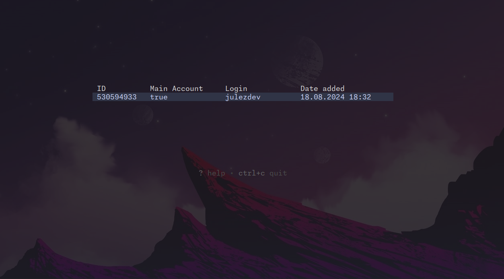
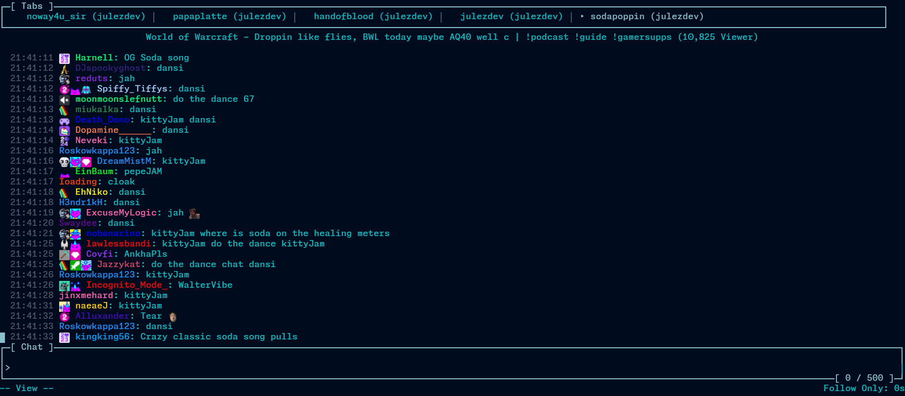
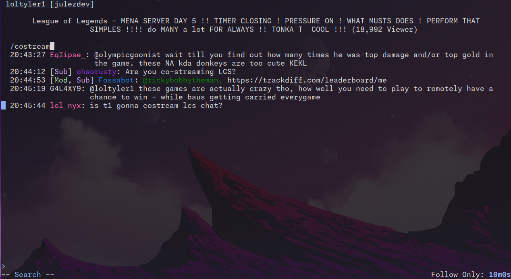
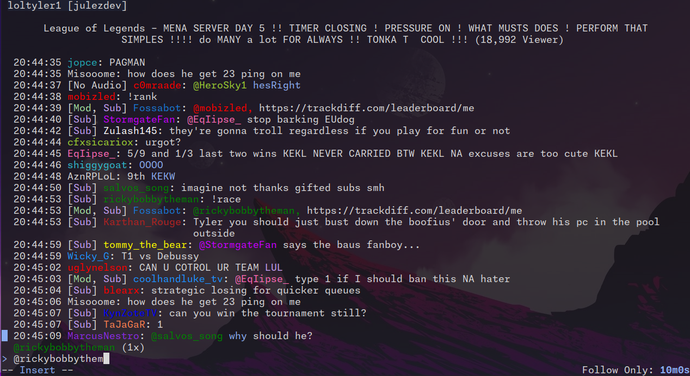
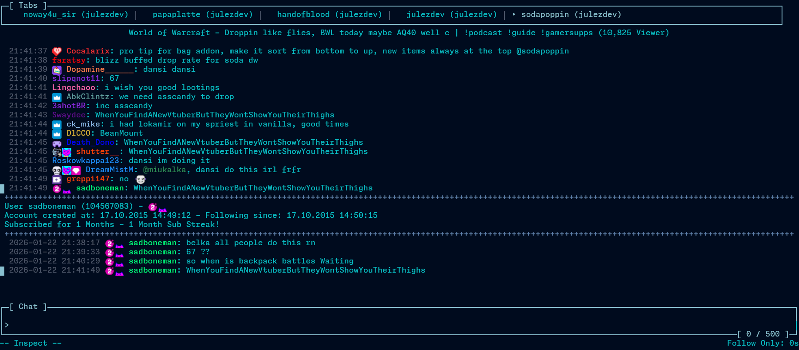
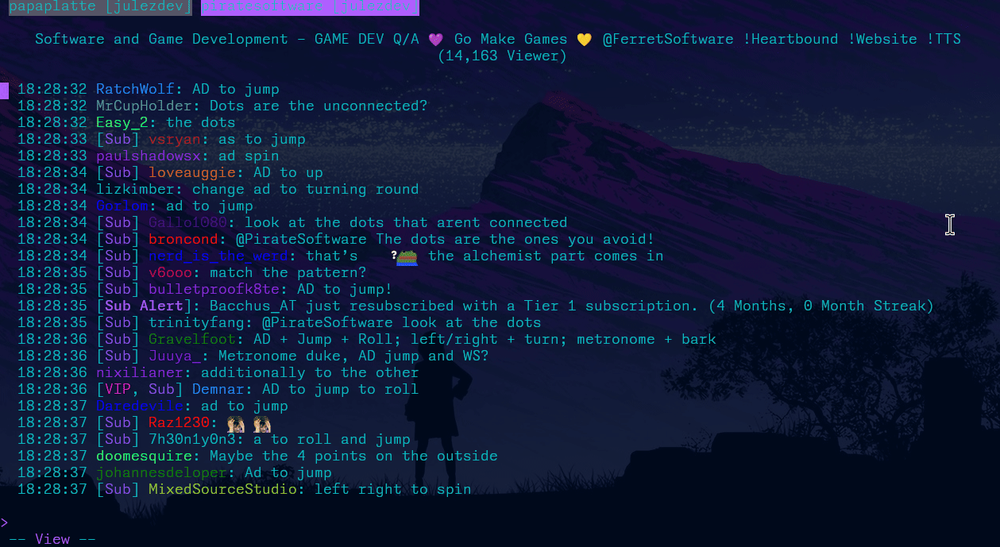

# Features

## Account management

Chatuino allows you to manage multiple account additionally to an anonymous account, which allows you to view a chat without logging in

## State persistence

Chatuino saves your open tab when you exist the application. When you start Chatuino again the application tries to restore the last session with all open tabs.

Chatuino is designed for Chatters who use multiple channels at once and for a long time.

## Chats

In Chats various twitch events will be displayed like messages, sub-gifts, timeouts, announcements, polls in your own chat etc.

You can use local commands like /localsubscribers and /uniqueonly to slow down chat for you locally.

Tap the / key to start a fuzzy search for messages or usernames which you can navigate with the arrow keys

Insert mode (aka writing a chat message/command) can be enabled with key-bind i and disabled with escape. Enter is used to send a message while alt+enter is used to send a messages but keep it in text input.
A simple message duplication bypass is also added when your message is the same as the last message.
You can also copy a message to you message input by pressing alt+c on a message.

Use t to go to top of buffer and b to go down.

Hit the `?` key-bind to discover more key-binds.

## Auto Completions

Chatuino allows auto completion for completing channel names when joining a new chat, usernames in chat or emotes.

Commands like ban, unban, timeout will also be suggested to you

## User Inspect

You can closely inspect a single chatter, showing you all their messages (that you saw only), their follow age and subscription status.

Fuzzy search is also supported. You can start user inspect mode with the key-bind ctrl+l or the command /inspect username. Chatuino will also display all messages that mention the user.

While Chatuino is only allowed to show messages that you saw, every message will be persisted locally, when configured in settings, allowing you to keep a local log of all chats you visit. See [settings](SETTINGS.md) for details.

## Emotes

Chatuino can display emotes as text or graphical images, depending on terminal and OS. See [settings](SETTINGS.md) for details.

## Tab kinds

Chatuino offers three different tab kinds when creating a new tab with ctrl+t.

- Channel
- Mention
- Live Notification

*Channel* is the default tab kind. You join a specific channel/broadcaster just like the normal web chat.

*Mention* displays all messages from all open *Channel* tabs that mention one of the users configured to be used by Chatuino.
A bell emoji in the tab name will notify you that you have been mentioned.

*Live Notification* will notify you once a *Channel* in an open tab went online or offline. If a channel went offline a bell emoji will be displayed next to the tab.
