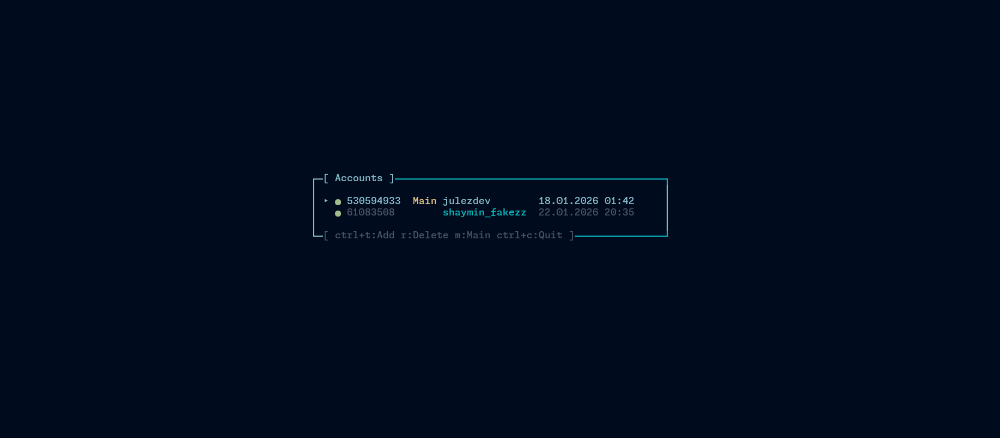
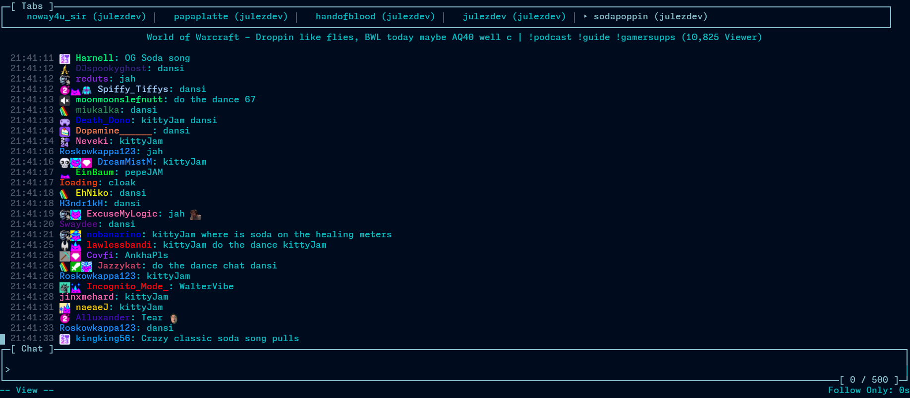
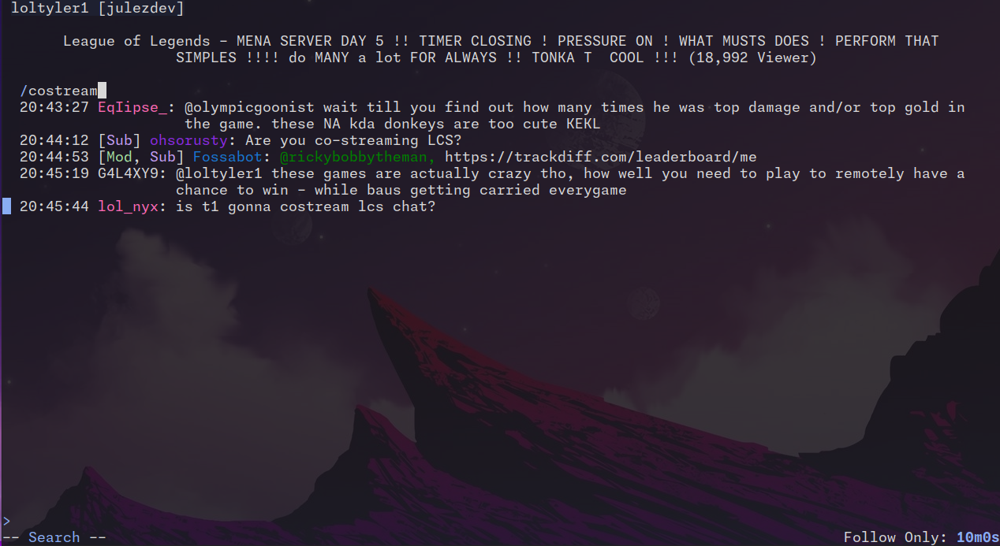
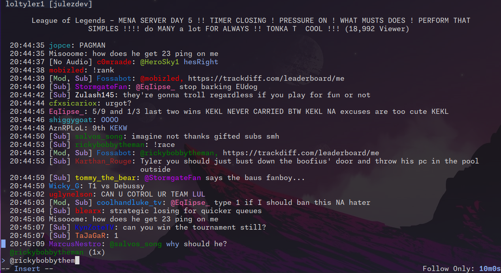
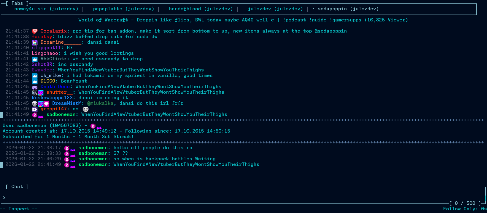
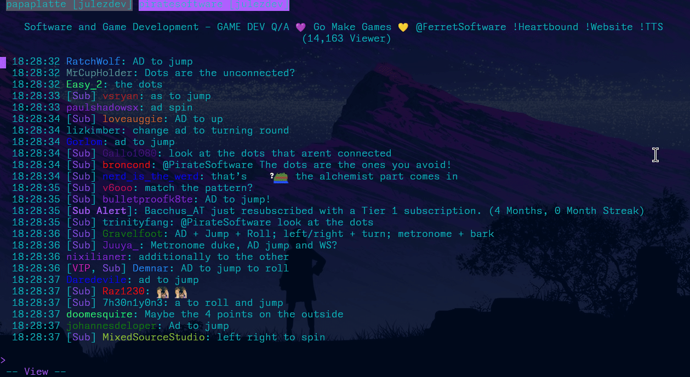

# Features

## Account Management

Chatuino allows you to manage multiple accounts in addition to an anonymous account, which lets you view chat without logging in.

## State Persistence

Chatuino saves your open tabs when you exit the application. When you restart, it attempts to restore your last session with all open tabs.

Chatuino is designed for users who monitor multiple channels simultaneously over extended periods.

## Chat

Chatuino displays various Twitch events including messages, sub-gifts, timeouts, announcements, and polls in your own chat.

Use local commands like `/localsubscribers` and `/uniqueonly` to filter chat locally.

Press `/` to search chat messages. Navigate results with arrow keys, press Enter to jump to a match, or Escape to cancel.

### Search Syntax

By default, typing a term searches both message content and usernames. Use prefixes to target specific fields or apply advanced filters:

| Filter | Description |
|---|---|
| `hello` | message or username contains "hello" |
| `content:term` | message content contains term |
| `user:term` | username contains term |
| `badge:name` | user has badge (e.g. `badge:moderator`) |
| `is:mod` | mod messages only (also: `sub`, `vip`, `first`) |
| `/pattern/` | regex on content and username |
| `regex:pattern` | regex on content and username |
| `user:/pattern/` | regex scoped to username only |
| `content:/pattern/` | regex scoped to content only |
| `-filter` | negate any filter (e.g. `-user:nightbot`) |
| `"quoted value"` | match a phrase with spaces |

Multiple filters are combined with AND. For example, `user:julez content:GG is:sub` matches messages from "julez" containing "GG" that are from a subscriber.

Aliases: `msg:` for `content:`, `from:` for `user:`.

Enable insert mode (for writing messages/commands) with `i` and exit with Escape. Press Enter to send a message, or Alt+Enter to send while keeping the text in the input.
A simple duplication bypass is included when your message matches the last message.
Copy a message to your input by pressing Alt+C on the message.

Press `t` to jump to the top of the buffer and `b` to jump to the bottom.

Press `?` to view all key bindings.

## Auto-Completion

Chatuino provides auto-completion for channel names when joining new chats, usernames in chat, and emotes.

Commands like `/ban`, `/unban`, and `/timeout` are also suggested.

## User Inspection

Inspect individual chatters to view all their messages (that you've seen), follow age, and subscription status.

Fuzzy search is supported. Start user inspection with Ctrl+L or the `/inspect username` command. Chatuino also displays all messages that mention the user.

Chatuino only shows messages you've seen, but every message can be persisted locally when configured in settings, allowing you to maintain a local log of all chats you visit. See [settings](SETTINGS.md) for details.

## Emotes

Chatuino can display emotes as text or graphical images, depending on terminal and OS. See [settings](SETTINGS.md) for details.

## Tab Types

Chatuino offers three tab types when creating a new tab with Ctrl+T:

- **Channel**: The default tab type. Join a specific channel/broadcaster, similar to the normal web chat.
- **Mention**: Displays all messages from open Channel tabs that mention one of your configured users. A bell icon in the tab name indicates new mentions.
- **Live Notification**: Notifies you when channels in open tabs go online or offline. A bell icon appears next to the tab when a channel goes offline.
