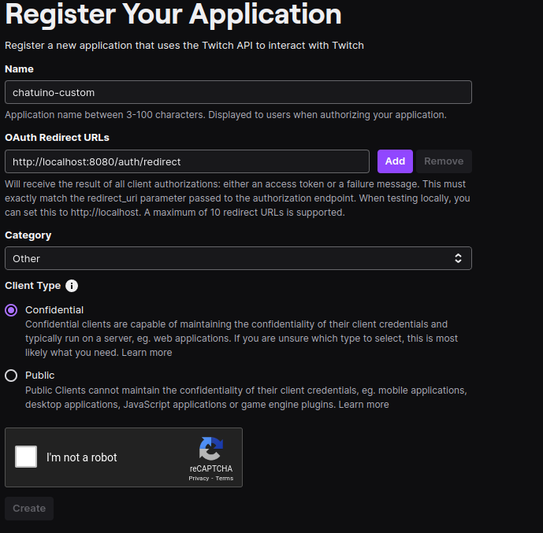

# Self Host

Chatuino needs a server component for handling authentication flow with Twitch.

Additionally, the server component is used for serving response from Twitch API endpoints that normally require a authenticated user oder app, when the anonymous account user is used to connect to a chat.

The server component in included inside the Chatuino binary.

## Prerequisite

In order to self host Chatuino, you need to authenticate an app with Twitch and obtain a `client_id` and `client_secret` for the app.

You can do this in the [twitch dev console](https://dev.twitch.tv/console/apps) under `Register Your Application`.

Twitch allows localhost as a valid non https redirect URL, make sure to use the port which will later be used by the server.



You can pass the client_id and client_secret to the server component via environment variables (`CHATUINO_CLIENT_ID` and `CHATUINO_CLIENT_SECRET`).

You also want to configure the `CHATUINO_API_HOST` (<http://localhost:8080> in this example) environment variable which is used by the Chatunito main app.

## Running the server

### Running the binary directly

You can run the server component by executing the Chatuino binary with the `server` subcommand.

```sh
chatuino --log --human-readable server --redirect-url=http://localhost:8080/auth/redirect
```

### Running the server inside docker

You can run the server component inside a docker container.

```sh
docker run -d \
 -e CHATUINO_CLIENT_SECRET \
 -e CHATUINO_CLIENT_ID \
 -e CHATUINO_REDIRECT_URL=http://localhost:8080/auth/redirect \
 -p 8080:8080 \
 ghcr.io/julez-dev/chatuino:latest --log server
```

> **Note**: Don't forget the http:// prefix in the `CHATUINO_REDIRECT_URL` environment variable.

## Launching Chatuino

After the server is started and `CHATUINO_API_HOST` is configured, you can start the Chatunito main app.

Example:

```sh
CHATUINO_API_HOST=http://localhost:8080 chatuino
```
